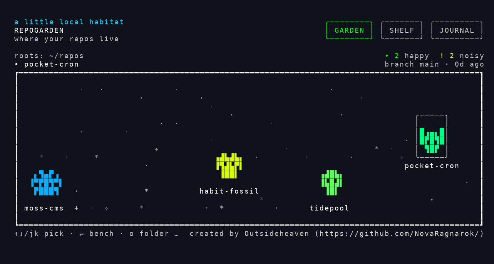

# RepoGarden

RepoGarden is a local-first pixel habitat where your repositories become tiny deterministic invader creatures.

The product is intentionally not dashboard-first. The default experience is a living scene that helps you notice projects, recover context, and resume with a small next move.

## Install

```bash
npm install -g @outsideheaven/repogarden
repogarden
```

## Preview



Each repo becomes a tiny pixel creature whose look reflects branch state, recency, and dirty files. Pick one and press `↵` to drop into a per-repo workbench.

<details>
<summary>ASCII version (regenerable from <code>scripts/tui-observe.sh</code>)</summary>

```
 a little local habitat                                        ╭────────╮ ╭───────╮ ╭─────────╮
 REPOGARDEN                                                    │ GARDEN │ │ SHELF │ │ JOURNAL │
 where your repos live                                         ╰────────╯ ╰───────╯ ╰─────────╯

 roots: ~/repos                                                            • 2 happy  ! 2 noisy
 • pocket-cron                                                             branch main · 0d ago
 ┏━━━━━━━━━━━━━━━━━━━━━━━━━━━━━━━━━━━━━━━━━━━━━━━━━━━━━━━━━━━━━━━━━━━━━━━━━━━━━━━━━━━━━━━━━━━━┓
 ┃                                                                                            ┃
 ┃            ·                                                                     ·         ┃
 ┃    ·                          ·                                            ✦               ┃
 ┃      ·   ·     ✧                                ✧ ▜▄▄▛  ✧                   ▜▄▄▄▛    ·     ┃
 ┃              ✧                     ▗▖▄▄▗▖         ▙██▟                      ▜▛█▜▛          ┃
 ┃                                     █▜▛█         ▝▜▟▙▛▘   *     ·        ⋆ ▝█████▘         ┃
 ┃                                    ▝████▘                    ·                             ┃
 ┃                  ·        ✧ +  ·   ▐▟▛▜▙▌       moss-cms ⋆            ·   tidepool ·   ·   ┃
 ┃   *                     ·                                    ·             ·               ┃
 ┃                                 habit-fossil      ·                                   ·    ┃
 ┃   ╭───────╮                                                              ⋆                 ┃
 ┃   │    ·  │                        *                       ·        +      *      ·        ┃
 ┃   │  ▄▄▄  │  ·                                 ·                      ✧  *   ·       ·     ┃
 ┃   │▗▐▙█▟▌▖│      ·          *              ✧     ·                                         ┃
 ┃   │▐▟▜█▛▙▌│                     *                               · ✧                        ┃
 ┃   ╰───────╯               ·                                             ·           *      ┃
 ┃                                                                                            ┃
 ┗━━━━━━━━━━━━━━━━━━━━━━━━━━━━━━━━━━━━━━━━━━━━━━━━━━━━━━━━━━━━━━━━━━━━━━━━━━━━━━━━━━━━━━━━━━━━┛
 ↑↓ move · ↵ open · / filter · g view · s settings · ? help · q quit                 RepoGarden
```

</details>

## Requirements

- Node 24+
- npm
- `git` on `PATH`
- a terminal at least 80×24

## Quick start

```bash
git clone https://github.com/NovaRagnarok/RepoGarden.git
cd RepoGarden
npm install
npm run dev
```

That runs the Ink-based terminal UI: scan, garden/shelf/journal views, per-repo workbench, mouse + keyboard. `npm install` runs `npm run build` automatically via the `prepare` script, so `node dist/cli.js` and the `repogarden` bin work right after install.

## Product guardrails

- The habitat is the product.
- The workbench is a utility room, not the main surface.
- If the home screen starts reading like a dashboard, the work is drifting.

## Privacy

RepoGarden is local-first. No repository contents are sent to any RepoGarden-operated server.

RepoGarden stores local app data under `~/.repogarden`, including configured roots, project notes, blockers, event logs, repo paths, commit subjects, and branch/vibe snapshots.

During normal operation the app reads repo paths, branch names, commit subjects and authors, dirty file names, and small diff previews for display in the habitat.

User-written notes, blockers, and journal content may contain private information. RepoGarden keeps that data local unless you explicitly copy or share it elsewhere.

### Reset local data

All local app state lives under `~/.repogarden`. To wipe it and start fresh:

```bash
rm -rf ~/.repogarden
```

The next launch will re-run onboarding and rebuild the journal/snapshot from a clean slate. RepoGarden never modifies your git repos themselves — this only clears the app's own files.

### Claude / Codex usage bar

The Claude/Codex usage bar is enabled by default in this alpha build.

When the ready UI renders (garden, shelf, or journal) or the workbench screen renders, RepoGarden attempts to read local Claude Code and Codex CLI OAuth credentials, refreshes tokens if needed, and calls the providers' usage endpoints directly. Refreshed tokens may be written back to the same local file or macOS Keychain entry used by those CLIs.

RepoGarden does not send these credentials to any RepoGarden-operated server. The credentials are used only to call the originating provider.

The implementation lives in:

- `src/lib/usage.ts`
- `src/hooks/use-usage.ts`

The endpoints used here are not documented public APIs and may change.

To disable the usage bar entirely for a run:

```bash
REPOGARDEN_DISABLE_USAGE=1 npm run dev
```

## Choose your path

### Human collaborator

Read [`CONTRIBUTING.md`](CONTRIBUTING.md) for the short repo map, common commands, and how to pick a safe slice.

### Product and architecture context

Read these core docs as needed:

1. [`docs/product-vision.md`](docs/product-vision.md)
2. [`docs/creature-system.md`](docs/creature-system.md)
3. [`ARCHITECTURE.md`](ARCHITECTURE.md)
4. [`BACKLOG.md`](BACKLOG.md) — current direction and live TODO list
5. [`docs/legacy-not-ported.md`](docs/legacy-not-ported.md) — what survived the v1→TUI cutover

## Common commands

```bash
npm run dev          # run the TUI
npm run typecheck    # tsc --noEmit
npm run test         # node --test
npm run build        # emit dist/
node dist/cli.js --help
```

## Support

If RepoGarden makes exploring your repos a little more delightful, a star helps other people find it.

If RepoGarden is useful to you, you can support it via [GitHub Sponsors](https://github.com/sponsors/NovaRagnarok) or Ko-fi:

[](https://ko-fi.com/outsideheaven)
